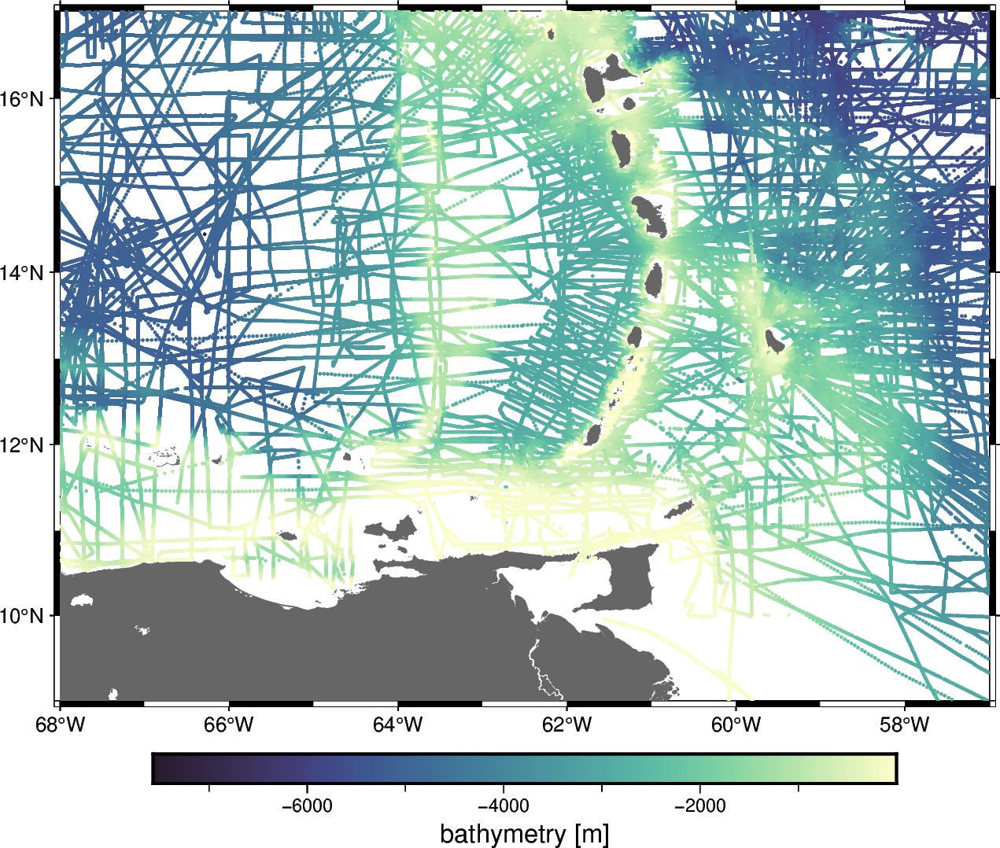

# Caribbean - Single-beam bathymetry

This dataset is a compilation of several single-beam bathymetry surveys of the
Caribbean ocean displaying a wide range of tectonic activity and uneven
distribution.

The original data file was compressed with LZMA to save space and make it
possible to upload it to this GitHub repository (see `raw/`) since there is not
direct download link we could use.

| | Summary |
|--:|:--|
| File | `caribbean-bathymetry.csv.xz` |
| Size | 1.3 Mb |
| Version | [v2](https://github.com/fatiando-data/caribbean-bathymetry/releases/latest) |
| DOI | https://doi.org/10.5281/zenodo.10631903 |
| License | [CC-BY](https://creativecommons.org/licenses/by/4.0/) |
| MD5 | `md5:79698c447daba7c15011a5528c8fe212` |
| SHA256 | `sha256:f90d5d34309df866321676efdea5ef4817fe71534c7190d3b495a33efd2dd20e` |
| Source | [NOAA NCEI](https://ngdc.noaa.gov/mgg/geodas/trackline.html) |
| Original license | [public domain](https://ngdc.noaa.gov/ngdcinfo/privacy.html) |
| Processing code | [`prepare.ipynb`](https://nbviewer.org/github/fatiando-data/caribbean-bathymetry/blob/main/prepare.ipynb) |

## Changes made

> These are the changes made to the original dataset.

Version 1:

* Convert from MGD77 to a simpler compressed CSV format.
* Retain only the survey ID, coordinates, and depth.
* Cut the data to a slightly smaller region.

Version 2:

* Reduce the region even more to reduce the data size.
* Remove problematic surveys that had systematic errors.
* Remove very dense surveys to reduce data size.

## About this repository

This is a place to format and prepare the original dataset for use in our
tutorials and documentation.

We include the source code that prepares the datasets for redistribution by
filtering, standardizing, converting coordinates, compressing, etc.
The goal is to make loading the data as easy as possible (e.g., a single call
to `pandas.read_csv` or `xarray.load_dataset`).
Whenever possible, the code also downloads the original data (otherwise the
original data are included in this repository).

> 💡 **Tip:** The easiest way to download this dataset is using
> [Pooch](https://www.fatiando.org/pooch), particularly to download straight
> from the DOI of a release.

## Contributing

See our [Contributing Guidelines][contrib] for information on proposing new
datasets and making changes to this repository.

## License

All Python source code is made available under the BSD 3-clause license. You
can freely use and modify the code, without warranty, so long as you provide
attribution to the authors.

Unless otherwise specified, all data files and figures created by the code are
available under the Creative Commons Attribution 4.0 License (CC-BY).

See [`LICENSE.txt`](LICENSE.txt) for the full text of each license.

The license for the original data is specified in this `README.md` file.

[contrib]: https://github.com/fatiando-data/.github/blob/main/CONTRIBUTING.md
